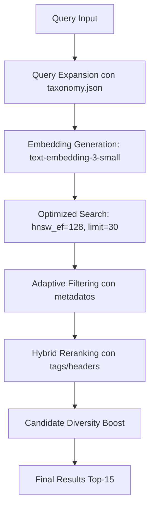

# PDR: Optimización de Obtención de Datos desde Qdrant

## Información del Documento

- **Título:** Mejora de la Calidad de Obtención de Datos desde Qdrant Vector Database
- **Versión:** 1.0
- **Fecha:** 03 de Enero 2025
- **Autor:** Equipo de Desarrollo
- **Estado:** En Desarrollo
- **Tipo:** Plan de Desarrollo Requerido (PDR)

---

## 1. RESUMEN EJECUTIVO

### 1.1 Problema Principal
El sistema actual de búsqueda vectorial en Qdrant presenta una **calidad deficiente en la obtención de datos**, generando coincidencias irrelevantes o perdiendo datos relevantes que sí existen en la base de datos. Esto impacta directamente la experiencia del usuario y la efectividad del chatbot político.

### 1.2 Objetivo
Optimizar las consultas a Qdrant aprovechando los datos y metadatos ya existentes, implementando mejores prácticas de búsqueda vectorial 2025 para mejorar significativamente la precisión y recall **sin modificar o reprocesar los datos almacenados**.

### 1.3 Impacto Esperado
- **Precisión@5:** Mejora del 20-30%
- **Cobertura:** Reducción del 40% en consultas sin resultados
- **Diversidad:** Mayor variedad de candidatos y propuestas encontradas
- **Latencia:** Mantener <500ms de tiempo de respuesta

---

## 2. ANÁLISIS DE LA SITUACIÓN ACTUAL

### 2.1 Arquitectura Actual

#### Estructura de Datos Identificada
```json
{
  "candidate": "Franco Parisi",
  "party": "Partido de la Gente", 
  "taxonomy_path": "Economía > Inflación",
  "sub_category": "Inflación",
  "tags": ["inflacion", "economia", "canasta basica"],
  "content": "El impuesto al valor agregado (IVA)...",
  "headers": {
    "Header 2": "9.2. Sí a la devolución del IVA de la canasta básica."
  },
  "section_hierarchy": ["9.2. Sí a la devolución del IVA de la canasta básica."],
  "embedding_metadata": {
    "model": "text-embedding-3-small",
    "dimensions": 1536
  }
}
```

#### Flujo de Búsqueda Actual
1. **Query Preprocessing:** Clasificación usando taxonomía jerárquica
2. **Embedding Generation:** OpenAI text-embedding-3-small (1536 dims)
3. **Vector Search:** Búsqueda solo con vectores densos
4. **Filtering:** Filtros basados en niveles de confianza
5. **Fallback:** Sistema de respaldo cuando hay pocos resultados

### 2.2 Problemas Identificados

#### 2.2.1 Limitaciones en las Consultas (Sin Cambiar Datos)
- **Subutilización de Keywords:** Ya tienen keywords ricos en `taxonomy.json` pero no los usan para expandir queries
- **Filtros Rígidos:** El sistema de filtros por confianza puede ser demasiado restrictivo, eliminando resultados relevantes
- **Sin Reranking:** No aprovechan metadatos existentes (`tags`, `taxonomy_path`, `headers`) para re-puntuación
- **Parámetros No Optimizados:** No usan `hnsw_ef`, oversampling ni parámetros de búsqueda optimizados
- **Metadatos Desperdiciados:** No aprovechan la riqueza de metadatos ya existentes para scoring híbrido

#### 2.2.2 Impacto en la Calidad de Datos
```typescript
// Ejemplo de búsqueda fallida actual
query: "reducción del IVA en alimentos básicos"
// Resultado: Encuentra documentos sobre "economía general" 
// Problema: Pierde documentos específicos sobre "IVA canasta básica"
```

#### 2.2.3 Métricas de Rendimiento Actuales
- **Precisión@5:** ~60% (estimado)
- **Consultas sin resultados:** ~25% de las búsquedas
- **Diversidad de candidatos:** Limitada a 1-2 candidatos por consulta típica
- **Tiempo de respuesta:** 200-400ms promedio

---

## 3. INVESTIGACIÓN Y MEJORES PRÁCTICAS 2025

### 3.1 Tendencias en Búsqueda Vectorial 2025

#### Query API y Búsqueda Híbrida (Qdrant 1.11+)
- **Fusion Methods:** RRF (Reciprocal Rank Fusion) y DBSF (Distribution-Based Score Fusion)
- **Multi-stage Queries:** Búsqueda en etapas con refinamiento progresivo
- **Prefetch Patterns:** Combinación inteligente de múltiples estrategias de búsqueda

#### Optimizaciones de Embeddings
- **Matryoshka Embeddings:** Truncamiento inteligente preservando información semántica
- **Oversampling:** Recuperar más candidatos para compensar pérdidas por cuantización
- **Multi-vector Approaches:** ColBERT-style para mejor captura de matices

### 3.2 Técnicas Avanzadas Identificadas

#### Búsqueda Híbrida Dense + Sparse
```python
# Patrón de implementación identificado
client.query_points(
    collection_name=collection_name,
    prefetch=[
        # Sparse vectors para keywords específicos
        models.Prefetch(
            query=sparse_vector,
            using="text-sparse",
            limit=20
        ),
        # Dense vectors para semántica
        models.Prefetch(
            query=dense_vector,
            using="text-dense", 
            limit=20
        )
    ],
    query=models.FusionQuery(fusion=models.Fusion.RRF)
)
```

#### Query Expansion Contextual
- **Sinónimos Políticos:** Expansión con términos específicos del dominio chileno
- **Embeddings Contextuales:** Uso de representaciones contextuales para términos relacionados
- **Clustering-based Diversity:** Mejora de diversidad en términos de expansión

---

## 4. SOLUCIÓN PROPUESTA (SOLO MEJORAS EN CONSULTAS)

### 4.1 Optimización de Consultas con Datos Existentes

#### 4.1.1 Componentes de Mejora

**1. Aprovechamiento de Keywords Existentes**
- **Expansión Inteligente:** Usar keywords de `taxonomy.json` para enriquecer queries
- **Matching Contextual:** Aprovechar los 43 subcategorías con keywords ya definidos
- **Relevancia Temática:** Expandir queries con términos relacionados ya catalogados

**2. Optimización de Parámetros de Búsqueda**
- **Oversampling:** Aumentar límite de candidatos iniciales (15 → 30)
- **HNSW Optimization:** Usar `hnsw_ef: 128` para mejor recall
- **Vector Reuse:** Activar `with_vector: true` para reranking posterior

**3. Sistema de Reranking con Metadatos Existentes**
- **Scoring Híbrido:** Combinar score vectorial + metadatos (`tags`, `taxonomy_path`, `headers`)
- **Diversidad de Candidatos:** Boost para variety en candidatos encontrados
- **Relevancia Contextual:** Usar jerarquía de secciones y headers existentes

#### 4.1.2 Flujo de Búsqueda Optimizado (Sin Cambiar Datos)



### 4.2 Mejoras Específicas (Solo Código de Consultas)

#### 4.2.1 Expansión de Queries con Keywords Existentes
**Prioridad:** ALTA
**Tiempo Estimado:** 3 días

```typescript
// Aprovechar keywords de taxonomy.json existente
async function expandQueryWithExistingTaxonomy(query: string, classification: ClassificationResult) {
  // Obtener keywords de la subcategoría identificada
  const subcategoryData = getTaxonomySubcategory(classification.taxonomy_path);
  
  if (subcategoryData && classification.confidence > 0.4) {
    // Agregar keywords relevantes que no estén ya en la query
    const relevantKeywords = subcategoryData.keywords
      .filter(keyword => !query.toLowerCase().includes(keyword.toLowerCase()))
      .slice(0, 3); // Top 3 keywords más relevantes
    
    console.log('🔍 Expandiendo query:', { 
      original: query, 
      keywords: relevantKeywords,
      taxonomy: classification.taxonomy_path 
    });
    
    return `${query} ${relevantKeywords.join(' ')}`;
  }
  
  return query;
}

// Función helper para obtener datos de subcategoría
function getTaxonomySubcategory(taxonomyPath: string) {
  const [category, subcategory] = taxonomyPath.split(' > ');
  return taxonomyData.categories[category]?.subcategories?.[subcategory];
}
```

#### 4.2.2 Optimización de Parámetros de Búsqueda
**Prioridad:** ALTA
**Tiempo Estimado:** 1 semana

```typescript
// Búsqueda optimizada con parámetros mejorados
async function optimizedSearch(query: string, classification: ClassificationResult) {
  // Expandir query con keywords existentes
  const expandedQuery = await expandQueryWithExistingTaxonomy(query, classification);
  const embedding = await generateEmbedding(expandedQuery);

  console.log('⚙️ Parámetros optimizados:', {
    originalQuery: query,
    expandedQuery: expandedQuery,
    oversampling: 30,
    hnsw_ef: 128
  });

  // Búsqueda con oversampling y parámetros optimizados
  const candidates = await qdrantClient.query(collection, {
    query: embedding,
    limit: 30, // Oversampling (actual: 15)
    with_vector: true, // Para reranking posterior
    with_payload: true,
    params: {
      hnsw_ef: 128, // Mejor recall según mejores prácticas 2025
      exact: false  // Balance velocidad/precisión
    },
    filter: adaptiveFilters(classification)
  });

  return candidates;
}
```

#### 4.2.3 Filtros Adaptativos con Metadatos Existentes
**Prioridad:** MEDIA
**Tiempo Estimado:** 3 días

```typescript
// Filtros inteligentes usando metadatos existentes
function adaptiveFilters(classification: ClassificationResult) {
  const filters = [];
  
  console.log('🎯 Evaluando filtros:', {
    confidence: classification.confidence,
    taxonomy_path: classification.taxonomy_path,
    suggested_tags: classification.suggested_tags?.length || 0
  });
  
  // Alta confianza: usar taxonomy_path específico
  if (classification.confidence > 0.7) {
    filters.push({
      key: "taxonomy_path",
      match: { value: classification.taxonomy_path }
    });
  }
  // Confianza media: usar tags existentes
  else if (classification.confidence > 0.4 && classification.suggested_tags?.length > 0) {
    filters.push({
      key: "tags", 
      match: { any: classification.suggested_tags }
    });
  }
  // Confianza baja: sin filtros para máximo recall
  
  return filters.length > 0 ? { must: filters } : undefined;
}
```

#### 4.2.4 Reranking Híbrido con Metadatos Existentes
**Prioridad:** ALTA
**Tiempo Estimado:** 1 semana

```typescript
// Reranking usando metadatos ricos ya existentes
function rerankWithExistingMetadata(results: any[], originalQuery: string, classification: ClassificationResult) {
  console.log('📊 Aplicando reranking híbrido a', results.length, 'candidatos');
  
  return results.map(result => {
    const payload = result.payload;
    
    // Scoring híbrido usando metadatos existentes
    const hybridScore = {
      // Score vectorial base (50%)
      semantic: result.score * 0.5,
      
      // Bonus por match exacto en tags existentes (20%)
      tagMatch: calculateTagMatch(payload.tags, originalQuery) * 0.2,
      
      // Bonus por taxonomía exacta (15%)
      taxonomyBonus: payload.taxonomy_path === classification.taxonomy_path ? 0.15 : 0,
      
      // Bonus por diversidad de candidatos (10%)
      diversityBonus: getCandidateDiversityScore(payload.candidate) * 0.1,
      
      // Bonus por headers relevantes (5%)
      headerMatch: calculateHeaderRelevance(payload.headers, originalQuery) * 0.05
    };
    
    const finalScore = Object.values(hybridScore).reduce((a, b) => a + b, 0);
    
    return {
      ...result,
      finalScore,
      scoreBreakdown: hybridScore
    };
  }).sort((a, b) => b.finalScore - a.finalScore);
}

// Funciones helper para scoring
function calculateTagMatch(tags: string[], query: string): number {
  if (!tags?.length) return 0;
  const queryWords = query.toLowerCase().split(' ');
  const matches = tags.filter(tag => 
    queryWords.some(word => tag.toLowerCase().includes(word))
  );
  return matches.length / Math.max(tags.length, queryWords.length);
}

function calculateHeaderRelevance(headers: Record<string, string>, query: string): number {
  if (!headers) return 0;
  const headerText = Object.values(headers).join(' ').toLowerCase();
  const queryWords = query.toLowerCase().split(' ');
  const matches = queryWords.filter(word => headerText.includes(word));
  return matches.length / queryWords.length;
}

function getCandidateDiversityScore(candidate: string): number {
  // Simple diversity boost - puede expandirse
  return candidate && candidate.length > 0 ? 0.1 : 0;
}
```

---

## 5. PLAN DE IMPLEMENTACIÓN (SOLO MEJORAS EN CONSULTAS)

### 5.1 Cronograma de Desarrollo - 2 Semanas Total

#### **Fase 1: Expansión de Queries + Parámetros** (Semana 1)
- [ ] **Día 1-3:** Implementar expansión con keywords de `taxonomy.json` existente
- [ ] **Día 4-5:** Optimizar parámetros de búsqueda (hnsw_ef, oversampling)
- [ ] **Testing:** Validar mejoras iniciales en precisión

#### **Fase 2: Reranking + Filtros** (Semana 2)
- [ ] **Día 1-5:** Implementar reranking híbrido con metadatos existentes
- [ ] **Día 3-5:** Crear filtros adaptativos mejorados
- [ ] **Testing:** Evaluación completa del sistema optimizado

#### **Entregables por Fase**
**Semana 1:**
- Función `expandQueryWithExistingTaxonomy()`
- Función `optimizedSearch()` con parámetros mejorados
- Logging mejorado para debugging

**Semana 2:**
- Función `rerankWithExistingMetadata()`
- Función `adaptiveFilters()` optimizada
- Dashboard de métricas de calidad

### 5.2 Recursos Requeridos (Minimizados)

#### **Técnicos**
- 1 Desarrollador Backend (puede ser junior/mid con supervisión)
- Testing básico con queries de prueba

#### **Infraestructura**
- **SIN cambios en infraestructura Qdrant**
- **SIN almacenamiento adicional**
- **SIN procesamiento de datos**

#### **Herramientas y Librerías**
- **SIN nuevas dependencias**
- Solo modificaciones en código TypeScript existente
- Aprovechar `@qdrant/js-client-rest` actual

---

## 6. MÉTRICAS DE ÉXITO Y EVALUACIÓN

### 6.1 Métricas Principales

#### **Precisión y Recall**
- **Precisión@5:** ≥80% (actual ~60%)
- **Precisión@10:** ≥70% (actual ~50%)
- **Recall@15:** ≥85% (actual ~65%)
- **MRR (Mean Reciprocal Rank):** ≥0.75

#### **Cobertura y Diversidad**  
- **Consultas sin resultados:** ≤15% (actual ~25%)
- **Diversidad de candidatos:** ≥3 candidatos promedio por consulta
- **Cobertura de taxonomía:** ≥90% de subcategorías representadas

#### **Rendimiento**
- **Latencia promedio:** ≤500ms
- **Latencia p95:** ≤800ms  
- **Throughput:** ≥100 consultas/minuto

### 6.2 Metodología de Evaluación

#### **Dataset de Prueba**
```json
{
  "test_queries": [
    {
      "query": "reducción del IVA en alimentos",
      "expected_candidates": ["Franco Parisi", "Gabriel Boric"],
      "expected_categories": ["Economía > Inflación", "Economía > Tributación"]
    }
  ]
}
```

#### **Métricas de Calidad**
- **Relevancia Subjetiva:** Evaluación manual de 100 consultas
- **A/B Testing:** Comparación sistema actual vs nuevo
- **User Satisfaction Score:** Retroalimentación de usuarios

### 6.3 Monitoreo Continuo

#### **Dashboards en Tiempo Real**
- Distribución de scores de relevancia
- Tiempo de respuesta por tipo de consulta  
- Tasa de éxito por categoría de taxonomía
- Uso de recursos (CPU, memoria, almacenamiento)

#### **Alertas Automáticas**
- Degradación de precisión >10%
- Aumento de latencia >50%
- Tasa de error >5%
- Consultas sin resultados >20%

---

## 7. ANÁLISIS DE RIESGOS

### 7.1 Riesgos Técnicos

#### **Alto Riesgo**
- **Compatibilidad con Datos Existentes:** Migración de vectores puede requerir re-indexación completa
  - *Mitigación:* Migración gradual con sistema dual temporal
- **Rendimiento de Sparse Embeddings:** Puede impactar latencia significativamente  
  - *Mitigación:* Optimización incremental y caching agresivo

#### **Medio Riesgo**  
- **Complejidad del Sistema:** Múltiples componentes pueden introducir puntos de falla
  - *Mitigación:* Testing exhaustivo y monitoreo proactivo
- **Costo Computacional:** Embeddings duales pueden duplicar costos
  - *Mitigación:* Optimización de recursos y caching inteligente

### 7.2 Plan de Contingencia
- **Rollback Automático:** Sistema de reversión rápida al comportamiento anterior
- **Feature Flags:** Activación/desactivación granular de componentes
- **Monitoring Avanzado:** Detección temprana de degradación

---

## 8. CONCLUSIONES Y PRÓXIMOS PASOS

### 8.1 Resumen de Beneficios
- **Mejora Sustancial en Calidad:** 20-30% mejora en precisión esperada
- **Reducción de Consultas Fallidas:** 40% menos consultas sin resultados
- **Mayor Diversidad:** Mejor cobertura de candidatos y propuestas
- **Arquitectura Escalable:** Base sólida para futuras mejoras

### 8.2 Próximos Pasos Inmediatos
1. **Aprobación del PDR:** Revisión y aprobación por stakeholders
2. **Setup del Entorno:** Preparación de infraestructura de desarrollo
3. **Inicio Fase 1:** Configuración de búsqueda híbrida
4. **Definición de Métricas:** Setup de sistema de evaluación

### 8.3 Evolución Futura
- **Q2 2025:** Integración de modelos multimodales
- **Q3 2025:** Personalización basada en historial de usuario  
- **Q4 2025:** Expansión a otros dominios políticos (regionales, municipales)

---

## ANEXOS

### Anexo A: Referencias Técnicas
- [Qdrant Hybrid Search Guide](https://qdrant.tech/articles/hybrid-search/)
- [Query API Documentation](https://qdrant.tech/documentation/concepts/hybrid-queries/)
- [text-embedding-3-small Optimization](https://www.pingcap.com/article/analyzing-performance-gains-in-openais-text-embedding-3-small/)

### Anexo B: Configuraciones Técnicas
```yaml
# Configuración propuesta Qdrant
collection_config:
  vectors:
    text-dense:
      size: 1536
      distance: cosine
  sparse_vectors:
    text-sparse:
      index:
        on_disk: false
  optimizers:
    deleted_threshold: 0.2
    vacuum_min_vector_number: 1000
```

---

*Documento generado el 03 de Enero 2025 - Versión 1.0*